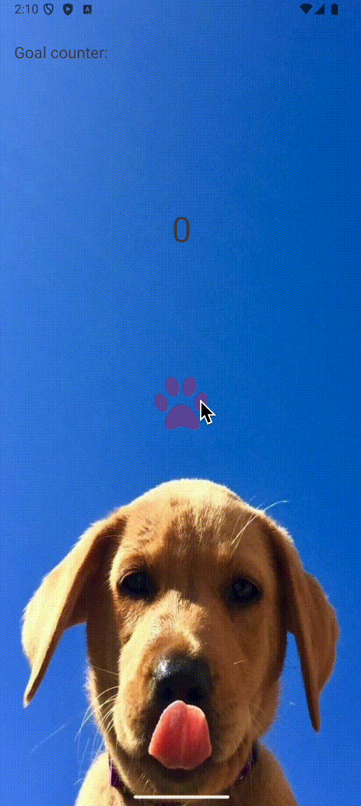

# Lab 1: Tap Counter App

Course Link: [CodePath Android Course](https://courses.codepath.org/courses/and102/unit/1#!labs)

Submitted by: **Palina Pauliuchenka** <!-- Replace 'Your Name Here' with your actual name -->

**Tap Counter App** is an Android app inspired by idle tap games, allowing users to accumulate points through taps, which can be exchanged for upgrades.

Time spent: **2** hours spent in total <!-- Replace 'X' with the number of hours you spent on this project -->

## Application Features

### Required Features

The following **required** functionality is completed:

- [x] (2 pts) **User can see a number displayed on the screen. The number starts at 0.**
- [x] (2 pts) **User can tap on a button to see the number displayed increase by 1.**

### Stretch Features

The following **stretch** functionality is implemented:

- [x] (2 pts) **User can exchange the number of taps accumulated for upgrades:**
    - X taps for an upgrade that makes each tap count as 2 taps. (Default: 10 taps)
        - Use a Toast for positive (purchase) or negative (can't afford) notifications.

- [x] (2 pts) **User can exchange taps for a custom icon button.**
    - X taps for a custom icon button. (Default: 10 taps)
        - Use a Toast for positive (purchase) or negative (can't afford) notifications.

- [x] (2 pts) **User can customize the app's theme (e.g., a dog-themed background with a paw print button).**

- [x] (+2 bonus pts) **User has progressively difficult goals to reach in terms of the number of taps accumulated.**
    - Display each goal on the screen, and track the total number of goals reached.
    - Use a Toast to notify of a reached goal.

[//]: # (![Image/GIF showing goals and progress]&#40;lab-1.gif&#41;)




## Notes

Describe any challenges encountered while building the app. <!-- Replace this with your specific challenges and experiences -->

## Resources

- [ConstraintLayout documentation](https://developer.android.com/training/constraint-layout)
- [Displaying Toasts](https://guides.codepath.com/android/Displaying-Toasts)

## License

```plaintext
    Copyright 2024 Palina Pauliuchenka

    Licensed under the Apache License, Version 2.0 (the "License");
    you may not use this file except in compliance with the License.
    You may obtain a copy of the License at

        http://www.apache.org/licenses/LICENSE-2.0

    Unless required by applicable law or agreed to in writing, software
    distributed under the License is distributed on an "AS IS" BASIS,
    WITHOUT WARRANTIES OR CONDITIONS OF ANY KIND, either express or implied.
    See the License for the specific language governing permissions and
    limitations under the License.